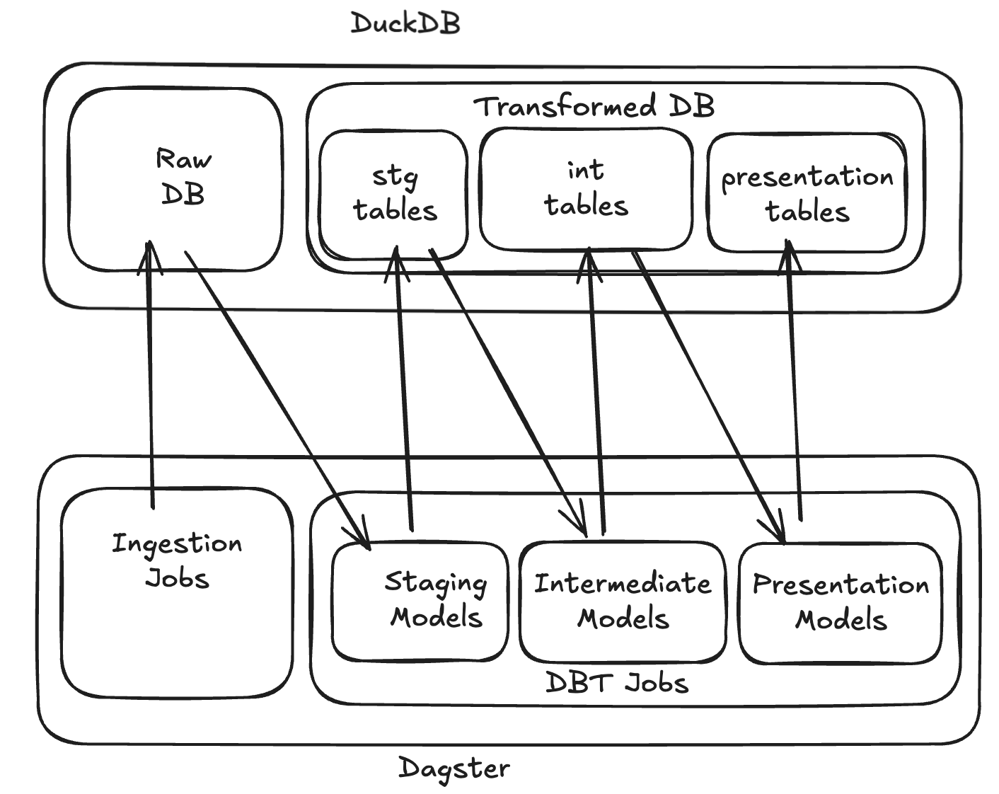

## What is this project?
The purpose of this project is to provide a real environment to practice data engineering without needing to spend money on cloud tools or subscriptions. It was created using all open source tools and is set up to be run entirely locally using duckdb.

## Getting started
- Install UV 
   - `brew install uv`
- Install duck db 
   - `brew install duckdb`
- Install dependencies 
   - `uv sync`
- Buid db files in duckdb
   - `cd duckdb && uv run dbt build`

## How the pipeline work?
This project uses Dagster as an orchestration tool. All dagster assets are in the `defs` directory. 

- The swell data is stored unprocessed in a raw catalog in duckdb.
- In the intermediate model, the max swell height for each day is retrieved.
- The presentation layer in this case is just a passthrough for the int model.
 
 

## Dagster 
Dagster is an orchestration tool used to create DAGs that will define and run data ingestion and transformation jobs.

Some key concepts for Dagster are:
- Assets - Anything in the `defs` directory with an `@dg.asset` annotation will become a job that can be run.
- Dependencies -  Any asset can be passed as a dependency to another asset through the `dependencies` argument in the `@dg.asset` annotation 

## DBT
The DBT models use a three layer architecture:
- Staging: Staging models should contain minimal processing logic. These models are used for light preparation. Unpacking json, adding surrogate keys etc.
- Intermediate: Intermediate models are where the main transformation work happens. These models will contain the business logic for a particular pipeline. 
- Presentation: Presentation models are the external facing contract with downstream consumers. These models should also contain minimal logic but can be used to join with other models, change fields to make them uniform, etc.